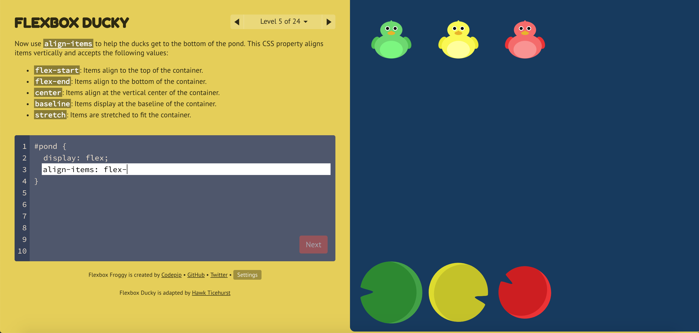

Flexbox Ducky
=======

Flexbox Ducky is an adapted version of [Flexbox Froggy](https://github.com/thomaspark/flexboxfroggy) for CSE 154: Web Development at the University of Washington. Check it out at the [CSE 154 Website](https://courses.cs.washington.edu/courses/cse154/flexboxducky/).

Also check out the original at [flexboxfroggy.com](http://flexboxfroggy.com).

## Original Author

Thomas Park

* [Twitter](https://twitter.com/thomashpark)
* [Homepage](http://thomaspark.co)
* [GitHub](https://github.com/thomaspark)

## Adapted Author

Hawk Ticehurst

* [Instagram](https://www.instagram.com/hawkticehurst/)
* [GitHub](https://github.com/hawkticehurst)

## Copyright and License

Copyright 2015-2017 Thomas Park. Code released under [the MIT License](https://github.com/thomaspark/flexboxfroggy/blob/gh-pages/LICENSE). Images released under [Creative Commons](https://creativecommons.org/licenses/by/3.0/legalcode.txt).
